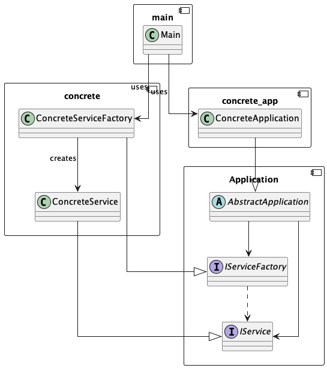

# archi-concrete-service-example

## Description

This a concrete Python implementation of the Abstract Factory Pattern from the Clean Architecture book by Uncle Bob.

The goal is to understand how to implement the Abstract Factory Pattern in Python and how to use it in a simple example application.

The PlantUML diagram of the example application is available in the `docs` folder.

## Architecture Diagram

